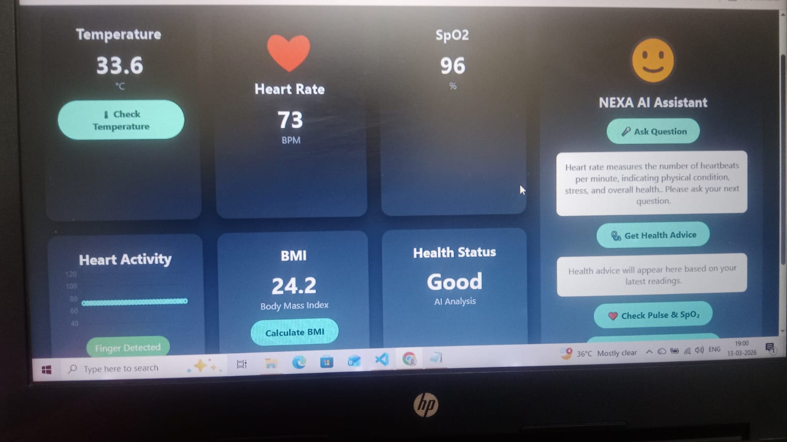

#  AI-Powered IoT-Based Smart Health Monitoring and Diagnostic System (NEXA)

---

##  Project Overview

This project is an advanced AI-integrated IoT-based health monitoring system developed using ESP32. It continuously monitors vital health parameters such as heart rate, SpO₂, and body temperature in real time. The system also integrates an AI assistant, voice interaction (STT & TTS), and a web-based dashboard for intelligent health analysis and remote monitoring.

The main objective of this project is to provide a smart, affordable, and real-time healthcare monitoring solution for home use, elderly care, and early health risk detection.

---

##  Key Features

- Real-Time Heart Rate Monitoring (MAX30100)
- Real-Time SpO₂ Monitoring
- Body Temperature Monitoring (DS18B20)
- AI-Based Health Status Analysis
- Web Dashboard with Live Graphs (Chart.js)
- Voice Assistant Integration
- Speech-to-Text (STT)
- Text-to-Speech (TTS)
- Downloadable Health Reports (PDF)
- BMI Calculator
- WiFi-Based Connectivity
- Cloud AI Integration (Groq API)

---

##  AI Integration

The system uses Groq Cloud AI (Large Language Model) to:

- Answer user questions
- Provide health-related advice
- Generate intelligent responses
- Support conversational interaction

The AI is connected through secure HTTPS communication using ESP32.

---

##  Speech-to-Text (STT) System

### How It Works:

The web dashboard uses the browser's built-in **Web Speech API** (`webkitSpeechRecognition`) for speech recognition.

### Working Process:

1. User clicks the "Ask Question" button.
2. The microphone activates.
3. User speaks their question.
4. The speech is converted into text using Speech Recognition.
5. The text is sent to the ESP32 server.
6. ESP32 forwards the question to the AI (Groq API).
7. AI generates a response.
8. The response is displayed on the dashboard.

### Purpose of STT:

- Allows hands-free interaction
- Makes the system user-friendly
- Enables natural conversation with AI assistant

---

##  Text-to-Speech (TTS) System

### How It Works:

The ESP32 uses **Google Translate TTS service** to convert text into speech.

### Working Process:

1. AI generates a response.
2. ESP32 sends the response text to Google TTS API.
3. The audio stream is received.
4. MAX98357A I2S audio module plays the sound through a speaker.
5. The user hears the AI response.

## Demo Video
## Demo Video
https://github.com/ankushsaroj530/AI-Powered-IoT-Based-Smart-Health-Monitoring-and-Diagnostic-System-NEXA-/blob/main/demo.mp4

### Purpose of TTS:

- Provides audio feedback
- Makes the system accessible
- Useful for elderly users
- Creates interactive AI experience

---

## 🛠 Hardware Required

- ESP32 Development Board
- MAX30100 Pulse Oximeter Sensor
- DS18B20 Temperature Sensor
- MAX98357A I2S Audio Module
- Speaker
- Breadboard
- Jumper Wires
- 4.7kΩ Resistor (for DS18B20)
- USB Cable
- WiFi Connection

---

##  Hardware Connections

###  MAX30100 (I2C Communication)

| Pin | ESP32 |
|------|--------|
| VCC  | 3.3V   |
| GND  | GND    |
| SDA  | GPIO 21 |
| SCL  | GPIO 22 |

---

###  DS18B20 Temperature Sensor

| Pin | ESP32 |
|------|--------|
| VCC  | 3.3V |
| GND  | GND |
| DATA | GPIO 15 |

Note: Use a 4.7kΩ pull-up resistor between DATA and VCC.

---

###  MAX98357A Audio Module (I2S)

| Pin | ESP32 |
|------|--------|
| VIN  | 5V |
| GND  | GND |
| BCLK | GPIO 26 |
| LRC  | GPIO 25 |
| DIN  | GPIO 27 |

---

##  System Workflow

1. Sensors collect real-time health data.
2. ESP32 processes and filters readings.
3. Data is displayed on the web dashboard.
4. AI analyzes health conditions.
5. User interacts with system using voice (STT).
6. AI responds using audio output (TTS).
7. Health reports can be downloaded as PDF.

---

##  Dashboard Features

- Live heart rate graph
- Real-time SpO₂ display
- Temperature monitoring
- BMI calculator
- Health status indicator
- AI assistant panel
- Report generation system

---

##  Future Improvements

- Cloud database integration
- Mobile application development
- Machine learning-based disease prediction
- Emergency alert system (SMS/Email)
- Multi-patient monitoring
- Wearable device optimization
- Firebase integration

---

##  Developed By

Ankush  
AI & IoT Health Monitoring System
